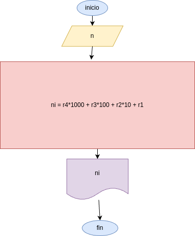

# Programa para imvertir un numero de cuatro digitos

## analisis 

### variables de entrada
- n: diigite el numero de 4 digito 

### procedimiento
r4 = n%10
r3 = (n//10)%10
r2 = (n//100)%10
r1 = (n//1000)%10

ni = r4*1000 + r3*100 + r2*10 + r1

## Diseño 

## constuccion

codigo en el archivo invertir_numero.py
